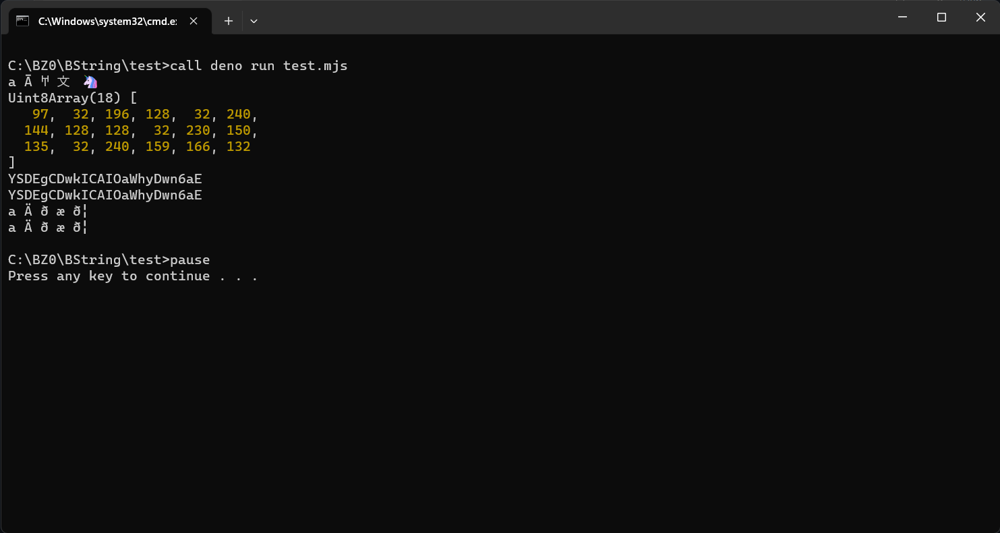

# 🔮 BString 🔮

Powerful string library, atomic, single and simple module...

## Why?

I want unify all coding or encoding methods of strings (such as UTF-8, UTF-16). I would special category for such string types.

Unfortunately around strings, around the same bits and bytes, there are many misconceptions, many possible interpretations or representations. I just want programmers (and even people) not to be confused with encodings. Yes, I was one of the first to notice a number of oddities, problems. I realized that it is time to create a library for more convenient work with encodings (especially UTF-8, and later UTF-16).

Also, there is an erroneous misconception that the number of characters equals the number of bytes. In fact, this turns out to be a fundamentally incorrect statement.

## Principles of information coding

You should always understand at least 3 input variables: the data itself, what encoding it is originally on, and what it should be transcoded to. Otherwise, it would be a complete nonsense. Unfortunately programming languages do not often explicitly specify typing by encoding (strings, bytes, etc.).

## Example of difference of encoding

Here I showing source UTF-8 string, encoded to Base64 correctly, and raw version (i.e. bytes).

### Screenshot is outdated!

> 

## Unification - time is come

### Part I - JavaScript

Already in development...

- [x] UTF-8
- [x] UTF-16
- [x] Binary or Bytes
- [x] Base64

Also, planned...

- [ ] Full [JSOX](https://github.com/d3x0r/JSOX.git) support
- [ ] Full [Civet](https://github.com/DanielXMoore/Civet) support

What we want to do?

- [x] Cross-compatibility
- [x] Cross-conversion

#### Such and that example

```js
import {UTF8, UTF16, Bytes} from "../src/js/index.mjs"

// BE ACCURE - UNICODE SAMPLE STRING!
const EXAMPLE0 = "a Ā 𐀀 文 🦄";

//
const _utf8bytes_ = Bytes.from(EXAMPLE0, "utf8");
const _utf8_ = EXAMPLE0;
const _base64_valid_ = "YSDEgCDwkICAIOaWhyDwn6aE";

//
console.log(_utf8_);
console.log(_utf8bytes_);
console.log(Bytes.as(_utf8bytes_, "utf8"));

//
console.log(UTF8.as(_utf8_, "base64"));
console.log(Bytes.as(_utf8bytes_, "base64"));
console.log(UTF8.as(_utf8_, "raw"));
console.log(Bytes.as(_utf8bytes_, "raw"));

//
const _utf16bytes_ = Bytes.from(EXAMPLE0, "utf16");
const _utf16_ = EXAMPLE0;

//
console.log(_utf16_);
console.log(_utf16bytes_);
console.log(Bytes.as(_utf16bytes_, "utf16"));

//
console.log(UTF16.as(_utf16_, "base64"));
console.log(Bytes.as(_utf16bytes_, "base64"));
console.log(UTF16.as(_utf16_, "raw"));
console.log(Bytes.as(_utf16bytes_, "raw"));
```

### Part II - C++ and STD

Planned...

#### `char8_t` vs classic `char` (misconception)

`char8_t` in C++ is means UTF-8 encoded character, whereas classic `char` is raw byte char. It's fundamental issue known also in JS.

In JS under classic `char` means `utf8_raw` or `utf8_bytes` encoding, while under `char8_t` means `utf8` char.

#### Windows UTF-8 locale (Beta)

Unfortunately, you may not notice the difference in encoding due to the formatting of the outgoing string itself (and back to UTF-8 😋). I've done the relevant experiments.

```cpp
#include <iostream>

//
int main()
{
    char8_t const* utf8 = u8"a Ā 𐀀 文 🦄";
    uint8_t const* raw = reinterpret_cast<uint8_t const*>(utf8);
    
    // But system thinks as UTF-8
    std::cout << raw << std::endl;

    // What char codes in reality
    for (uint32_t i = 0; i < std::char_traits<uint8_t>::length(raw); i++) {
        std::cout << (+raw[i]) << " ";
    }
    std::cout << std::endl;
}
```

### Part III - Uncover WinAPI

Planned...
